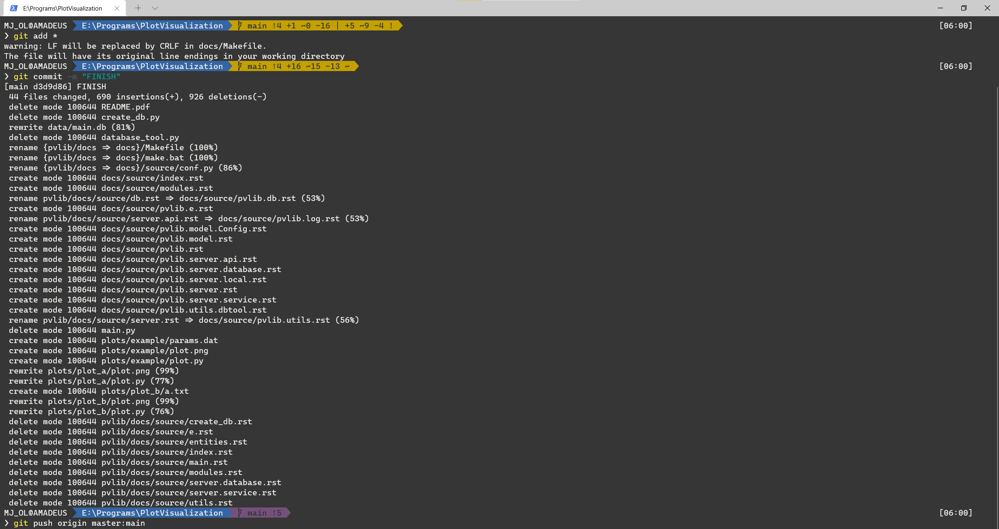
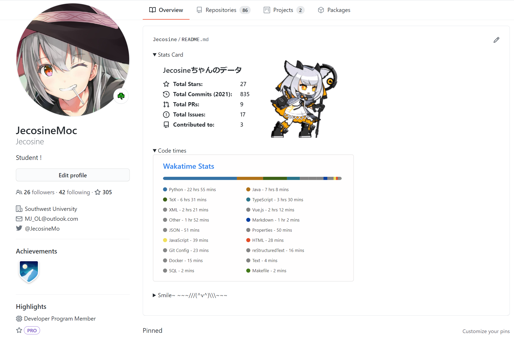
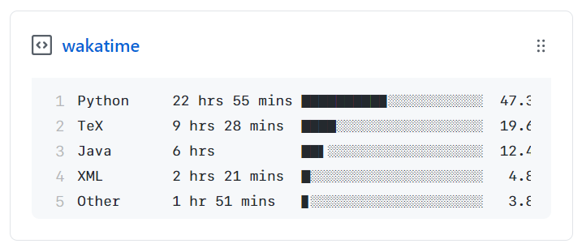
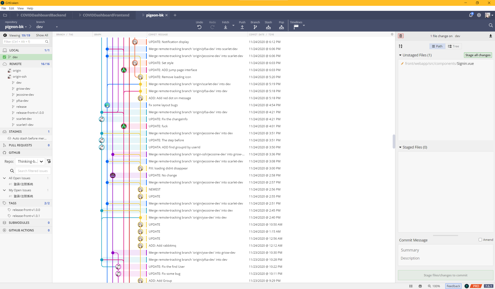

# 学院路小学小太阳编程兴趣班

[TOC]

##  Part I - 学术科研以及软件工程工具推荐

### 学术科研

#### 论文检索

- Google Scholar - [https://scholar.google.com/](https://scholar.google.com/)

  

  > 综合汇总型, 想要的都有, 用过都说好
  >  某匿名用户评价:
  > - ~~"敏感肌也可以用"~~
  > -  ~~"找不到的肯定是'**你的问题**'"~~ 
  > - ~~"不像百度学术, 我只会心疼xx"~~

- Research Gate - [https://www.researchgate.net/](https://www.researchgate.net/)

  

  > 综合性的科研论坛+资料库
  >  
  > - 提供论文以及书籍的基本信息和获取途径
  > - 与研究者交流与讨论
  > - 论文推荐系统
  > - 前沿研究进展

- Paper with Code - [https://www.paperswithcode.com/](https://www.paperswithcode.com/)

  

  > 汇总网站, 把某些领域(*主要是ML方向*)的论文和代码汇总起来

- Scopus - [https://scopus.com/](https://scopus.com/)

  

  > 同行评议文献数据库, 国外认可度更高.
  > ~~现在看看也就用下论文的引用关系查询，方便收集论文后面的参考文献~~

- arXiv.org

  > 非正式的电子印刷文档镜像, 里面的文献有些并未发表
  > 💡 **Tips:** 
  > *个人也可以在上面随便发, 但是不建议, 因为如果写的不好可能会影响你的学术评价,* 
  > *而且有些期刊要求文章不能在上面发表过*

- Engineer Village

  >  ~~都知道了, 就不说了:)~~

- IEEE

  > ~~都知道了, 就不说了:)~~

- Web of Science

  >  ~~都知道了, 就不说了:)~~

#### 参考资料检索

- Library Genesis - [http://libgen.rs/](http://libgen.rs/)

  

  > 未印刷的电子版本, 有点像arXiv
  >
  > 检索范围:
  >
  > - 参考书, ~~文章?~~ 
  > - 中文文献也有
  > - 甚至有小说

- ~~Allitebooks~~

- ZLibrary - [https://1lib.us/](https://1lib.us/) [https://z-lib.org/](https://z-lib.org/)

  

  > 检索范围 (外文)：
  >
  > - 文献, 参考书
  > - 小说之类的似乎也有

- 鸠摩电子书 - [https://www.jiumodiary.com/](https://www.jiumodiary.com/)

#### 阅读与文献管理工具

- Mendeley - [https://www.mendeley.com/](https://www.mendeley.com/)
  
  
  
  > 提供了浏览器插件, 下载文献
  
- Zotero - [https://www.zotero.org/](https://www.zotero.org/)
  
  > **开源** [https://github.com/zotero/zotero](https://github.com/zotero/zotero)
  
- Citavi - [https://citavi.com/](https://citavi.com/)
  
  > - 免费版限制单个文档内100个参考文献
  > - 提供了Web版本
  
- endnote - [https://endnote.com/](https://endnote.com/)
  
  > 老牌, 全面, UI好康, 就是要钱

#### Latex

$\LaTeX$是广为人知的基于$\TeX$文档排版系统, 主要是理工科方向的用的多, 通过代码的方式定制你的各种样式, 控制论文的排版等, 最重要的是方便管理文献.

**Overleaf**

在线的latex文档编辑与管理平台

- 快速编译
- 众多模板, 大部分大学/期刊/会议的论文标准模板都有在上面.

**TexStudio**

- 官方工具, 功能全面
- ~~界面丑, 10年前的风格~~

**Visual Studio Code**

- 通过插件**Latex Workshop**来实现对Latex编辑的支持
- 提供默认工作流, 也可以自定义(当使用某些宏包的时候也许需要修改编译参数)
- 界面美观好看
- 界面美观好看
- 界面美观好看

**Jetbrains?**

- ~~先把Markdown支持做好再说吧,球球了~~

#### 知识库管理

- Obsidian

  > - 标签网络图
  > - 标签化管理
  > - 开放的插件社区
  > - 双向引用
  > - 美观的界面风格, 斯巴拉西

- ~~静态博客生成器也不错~~
  
- 语雀等...
  
  > 没用过, 听说不戳

### 软件工程

#### 字体

<div style="line-height: 2em;
            height: 2em;
            padding-left: 1em;
            border-radius: 0.4em;
            font-family: 'FiraCode NF';
            font-size: 2em;
            color: white;
            background: linear-gradient(to right, #dd2244, #9999ee)">
  Fira Code
</div>


开源的免费Monospace字体, 支持连字(Ligature)
link: [https://github.com/tonsky/FiraCode](https://github.com/tonsky/FiraCode)


安装下载之后, 在IDE里面选择字体就行了, **记得打开Ligature选项**

**其他推荐:**

<div style="line-height: 2em;
            height: 2em;
            padding-left: 1em;
            border-radius: 0.4em;
            font-family: 'CaskaydiaCove NF';
            font-size: 2em;
            color: white;
            background: linear-gradient(to left, #dd2244, #9999ee)">
  Cascadia Code
</div>
#### Windows Terminal Powerline

配置方式:

 [https://docs.microsoft.com/zh-cn/windows/terminal/tutorials/powerline-setup](https://docs.microsoft.com/zh-cn/windows/terminal/tutorials/powerline-setup)

git目录下的效果



PyCharm中会显示python使用的环境


#### Typora主题推荐

主题商店: [https://theme.typora.io/](https://theme.typora.io/)

Markdown 渲染~~进化~~的本质 -- HTML
Theme 的本质 -- CSS ~~或其变态发育版(如scss, less)~~

例子:
<div style="
            border-radius:1em;
            padding-left: 2em!important;
            color:white;
            line-height: 3em;
            height: 3em;
            background-image:linear-gradient(to right, #dd2244, #9999ee)">
  This background is linear gradient
</div>
代码:

```html
<div style="border-radius:1em;
            padding-left: 2em!important;
            color:white;
            line-height: 3em;
            height: 3em;
            background-image:linear-gradient(to right, #dd2244, #9999ee)">
  This background is linear gradient
</div>
```

推荐: 
- **Blubook**
- **Vue**

<u>**根本原因 - 字体**</u>:

- <div style="font-family:'Noto Sans SC'; font-size: 1.2em"> Noto Sans SC 无衬线 </div>
- <div style="font-family:'Noto Serif SC'; font-size: 1.2em"> Noto Serif SC 有衬线 </div>

#### Atom Icon Plugin


#### Github Readme



创建一个以自己的用户名命名的仓库, 新建README.md, 其中的内容会渲染在你首页.

其中Status Card的效果是部署了一个

[https://github.com/anuraghazra/github-readme-stats](https://github.com/anuraghazra/github-readme-stats)

提供了一个返回SVG图片的API, 访客访问首页的时候会调用这个API获取当前用户的状态.可以定制内容显示方式和主题等, 但是样式有限.

魔改后的版本:

[https://github.com/Jecosine/github-readme-stats](https://github.com/Jecosine/github-readme-stats)

*私货: 欢迎Follow和各种Star [https://github.com/Jecosine](https://github.com/Jecosine)*

**Github Gist**

可以理解为代码片段, 也可以Pin在首页, 通过授权某些项目使用Github Action自动更新

下面是一个小样例: 

[https://github.com/matchai/waka-box](https://github.com/matchai/waka-box)

部署后, 默认每天0点(UTC)更新一次状态 (当然更新时间可以自定义, 修改Github Action的配置即可)



#### Wakatime

一款可以在多种IDE中记录你的代码时长的工具

[https://wakatime.com/](https://wakatime.com/)


#### Github1s

打开一个仓库,在url里面的github后面加上1s, 就可以快速地打开一个在线版的'vscode', 用于阅读代码

如 

[https://github.com/Jecosine/Jecosine](https://github.com/Jecosine/Jecosine) 

=>

[https://github1s.com/Jecosine/Jecosine](https://github1s.com/Jecosine/Jecosine)

### Git

版本管理系统(Version Control System)


图形化管理:

- GitKraken - 有学生优惠, ~~也可以直接破解~~



- SourceTree - 开源免费 (但是在windows下界面不太好康)

### 学生福利

- Github Education

- Jetbrains

  
  
  其中, DataGrip个人认为比Navicat好用, 而且**界面好看 (**

### Visual Studio Code Extensions

- Themes:
  - One Dark Pro
  - Material
  - Dracula
  - Office Theme ~~(Just for fun)~~
- Markdown All in One + Markdown Preview enhenced
- Office Viewer - 查看Word, PPT, Excel, PDF, Markdown 等, 部分可以编辑, 支持Markdown的可视化编辑(所见即所得, ~~但是个人觉得没有Typora好康~~, ~~故弃之~~) 

- indent-rainbow - 让你的缩进像彩虹一样五颜六色, 兴趣班小朋友狂喜 Jetbrains中有类似插件
- Rainbow Brankets - 让你的括号对五颜六色, 便于区分 Jetbrains中有同名插件
- jumpy - 快速光标移动 (AceJump in Jetbrains Plugin)


##  Part II - 兴趣班小朋友们最喜欢的编程相关的游戏

> *游戏是儿童最正当的行为，玩具是儿童的天使* 
>
> <div style="text-align:right">--鲁迅</div>

### GLADIABOTS - AI Combat Arena (角斗机甲 - AI竞技场)


#### 介绍

是一款机器人竞技题材的策略游戏，为你的机器人战队编制AI，让他们到竞技场中拼杀。不断改进、优化、反复打磨…或许你就能完爆对手并从在线的好友组中脱颖而出，打造一支所向披靡的钢铁之师！

#### 游戏特色

- 亲手制作AI，检阅机器人在竞技场中的表现
- 不断优化调整AI，直到战胜所有对手！
- 简洁却强力的AI编程系统，拥有近百种参数可供选择，百万种可能结果(无需编程经验即可开始！)
- 创造并自定义你的机器人战队

### Hacknet


#### 介绍

游戏中体验黑客攻防, Linux指令学习

#### 游戏特色 

- 真实的骇入
- 基于真实的UNIX指令，Hacknet将重点放在真实的骇入过程，而不是追求炫酷的好莱坞式黑客。
- 通过拟真化的骇入过程，让玩家们仿佛置身骇入现场，体验打破防火墙时几近真实的感受。

### MHRD (微硬公司)


#### 介绍

玩家就是一名集成电路工程师，我们负责的工作是设计集成电路芯片。从最简单的与非门开始，到计数器、存储器，最终目标是一个16bit的CPU。


## Part III - 龚酱の妙妙工具

### Convertio

链接: [https://convertio.co/zh/](https://convertio.co/zh/)

**功能:**

- ?
- ?


### Tampermonkey 插件

脚本推荐:

- ?
- ?
- ?
